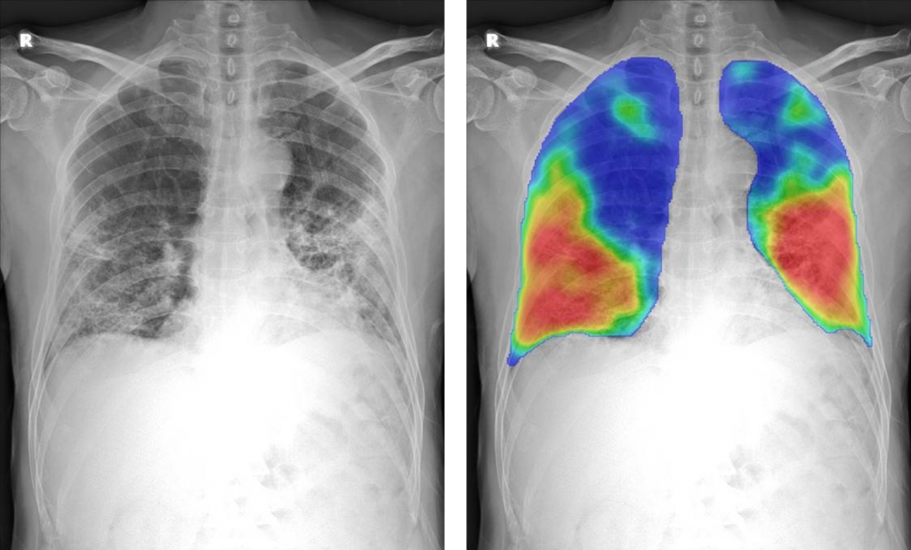
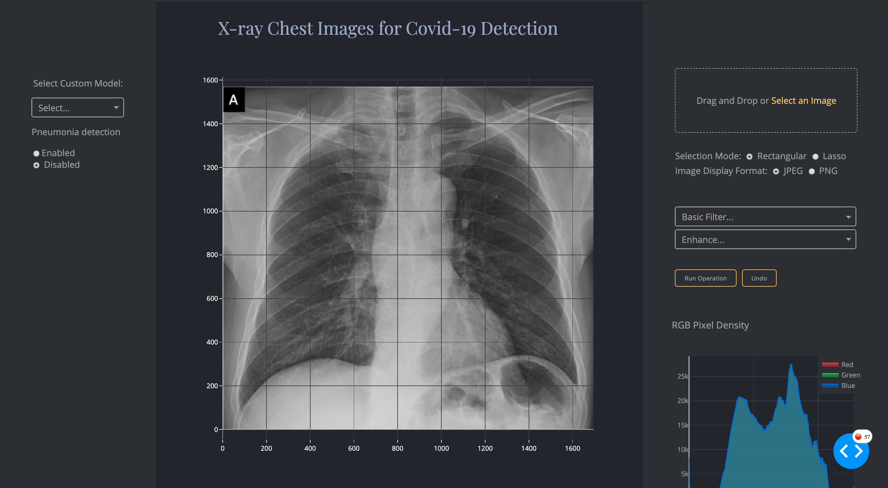

# Covid-19 Detection by X-ray Images Analysis


## Description

With successful experimental results and wide applications, Deep Learning for computer vision has the potential to change the future of healthcare. The use of Artificial Intelligence (AI) has become increasingly popular and is now used, for example, in cancer diagnosis and treatment.

The application and the works exposed in this repository concerns the diagnosis of patients probably suffering from Covid-19. The latter will be based on the image analysis of lungs passed to X-rays. For this purpose, a database is made up of images of healthy people and infected people. Deep learning models are developed for the needs of classification with a fairly large layer intended for the intelligibility of the models used. At the same time, a front-end component is developed for the visualization of data and model performance.

<p align="center">
  
</p>


### Prerequisites

Start to clone this git repository

```
git clone https://gitlab.com/yotta-academy/cohort-2020/projects/dl-projects/ej-crowd-detection.git
cd ej-crowd-detection
```

### Installing


Create and setup pip virtual environnement
```
source init.sh
```

activate it

```
source activate.sh
```
install dependencies
```
pip install -r requirements.txt
pip install -r requirements-front.txt
```

## Data

create a directory model/ in data folder. After that,
Downlaod the [data](https://drive.google.com/drive/folders/1o6urjaKXc_utdQfPRR6dtluM2KapBttW?usp=sharing), copy and paste it in data/ folder

## App Deployment
go to src/interface folder, run the following command
```
cd src/interface
python app.py
```
<p align="center">
  
</p>


## Training and testing command line 

```
python ./src/application/train.py --model Naive
python ./src/application/predict.py --model Naive image_path
```


## Authors

* **Johnatan Tricard**

* **Elhadji Gagny Sylla**


